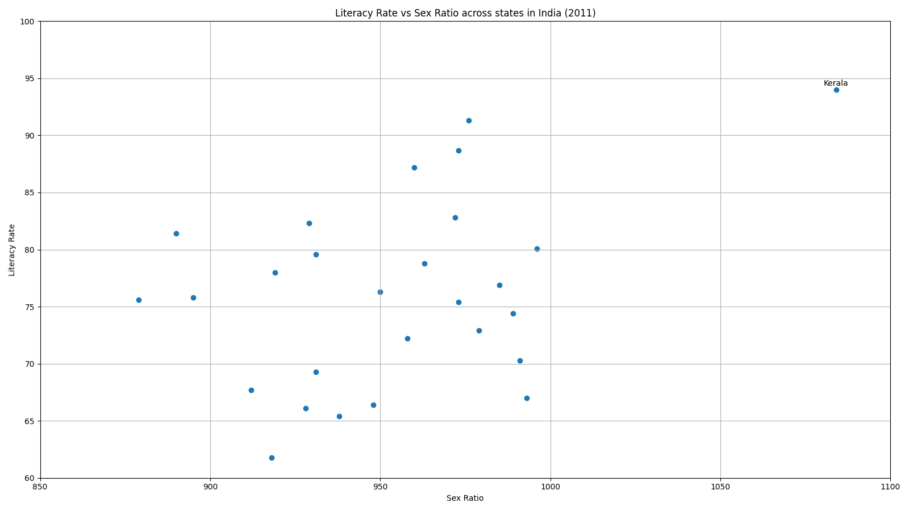
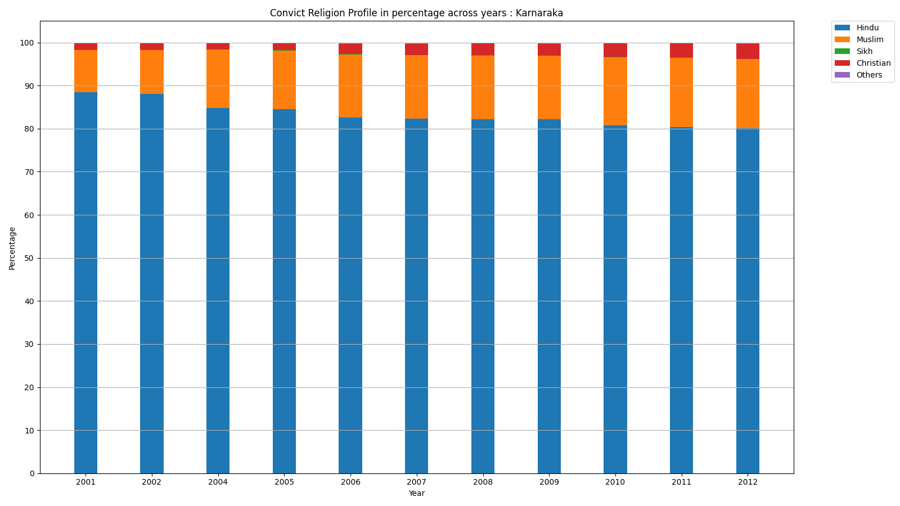
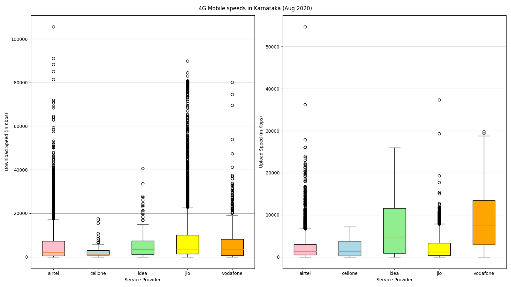

Plotting with matplotlib
------------------------

1. Scatter Plot
	* Dataset: 
		- State wise literacy rate ( https://data.gov.in/resources/state-level-literacy-rate-1951-2011 )
		- State wise sex ratio ( https://data.gov.in/resources/sex-ratio-females-1000-males-total-population-residence-2001-2011 )
	* Observations: Literacy rate and sex ratio are two important social indicators and one would expect them to be correlated with a positive
	correlation factor. To verify this, we plot the scatter plot for literacy rate (Y axis) vs sex ratio (X axis) for different states for the
	year 2011. The scatter plot shows that there is no correlation and the two social indicators interact in a more complicated way. Moreover,
	the state of Kerala is an outlier with a high literacy rate as well as a high sex ratio. Other studies also have been 

	

2. Bar Plot
	* Dataset:
		- Religion of inmates ( https://data.gov.in/resources/religion-inmates-end-year-during-2001-2012 )
	* Observations: We plot the religion profile of convicts for the state of Karnataka across the year 2001-2012. Note that for the year 2003,
	data is not available. The bar plot is stacked with the Y axis depicting the religion profile in percentage and the X axis being the years.
	A percentage stacked bar plot helps in analysing the variation of religion profile across time. As we can see, the percentage of Muslim 
	convicts increases from ~10% in 2001 to ~16% in 2011. Similar observation is made for the Christion religion profile as well which increases
	from ~1.5% in 2001 to ~3.5% in 2011. An 8% decrease is observed in the Hindu religion profile across years. Similar observations have been made
	on a national level [1].

	

3. Box Plot
	* Dataset:
		- Crowd-sourced mobile data speeds during August 2020 ( https://data.gov.in/node/6786602 ) 
	* Observations: We plot 4G upload and download box plots for different service providers in the state of Karnataka. Such an analysis will help
	the consumer in a better cost-benefit understanding. The Y axis has the speeds in Kbps (kilo bits per second). We observe that for download, Jio
	is the best service provider with Vodafone a close second. However, Jio also shows a lot of variation in the reported download speeds. For upload,
	Vodafone trumps Jio with a huge margin. Recently, the vodafone-idea merger was named the fasted mobile service provider [2].

	

[1] https://indianexpress.com/article/explained/muslims-daliots-undertrials-in-prison-ncrb-3734362/

[2] https://gadgets.ndtv.com/telecom/news/vi-airtel-jio-4g-download-speed-availability-india-q3-2020-ookla-2317520
